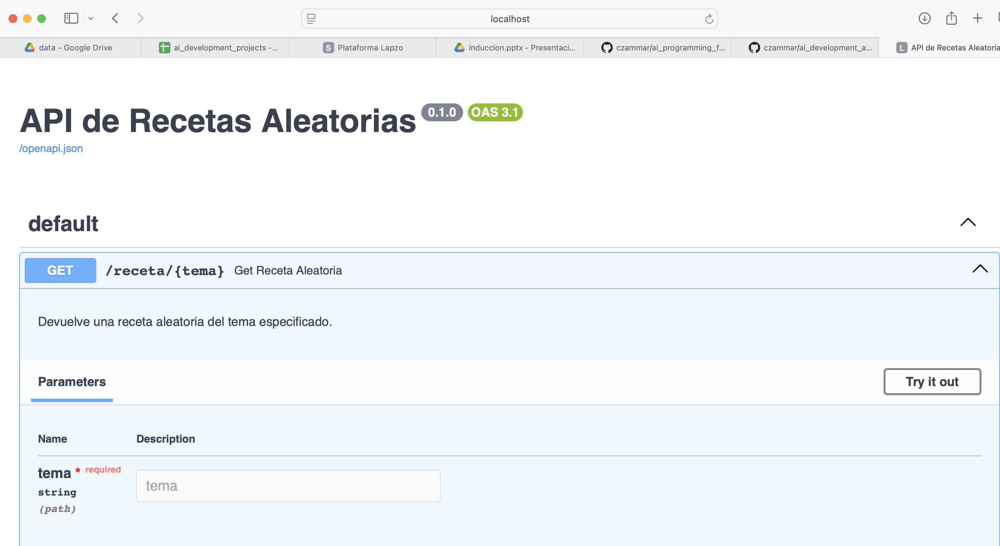
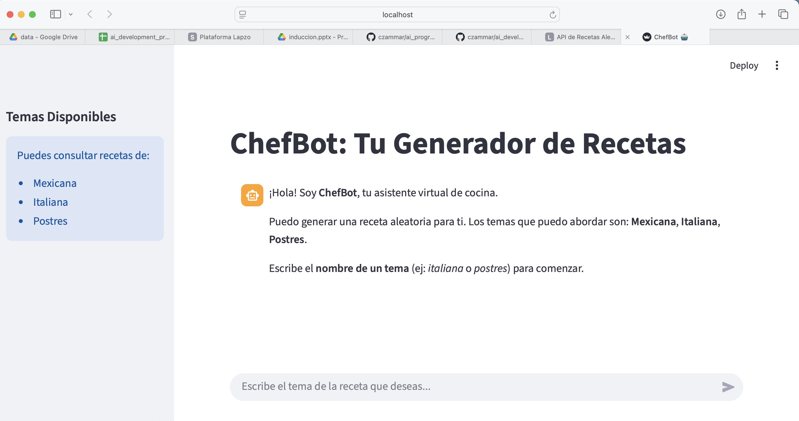

# ai_development_apps
A repository for basic AI Development applications

# ChefBot

## Paso 1: Crear un ambiente virtual
### Creando un ambiente virtual
**Windows**
```
py -m venv venv\ # Opcion 1
\AppData\Local\Programs\Python\Python312\python -m venv venv\ # Opcion 2
```
**Nota:** Debes cambiar el PATH ´\AppData\Local\Programs\Python\Python312\python´ por donde se encuentra instalada tu versión de Python.

**MacOS o GNU/Linux**
```
python3 -m venv venv/
```

## Paso 2: Activar el ambiente virtual
```
venv\Scripts\activate # Windows
source venv/bin/activate # Linux / MacOS
```

## Paso 3: Instalar las librerias
```
pip install -r requirements.txt
```

## Paso 4: Desplegar la aplicación de FastAPI
En una terminal con el ambiente virtual activo:
```
uvicorn src.recipes.api:app --reload
```

Lo anterior va a desplegar el API en `http://localhost:8000/docs`. 



## Paso 5: Desplegar el ChatBot de Streamlit
En **otra** terminal con el ambiente virtual activo:
```
streamlit run src/recipes/chatbot.py
```

Ello desplegará el chatbot en `http://localhost:8501/`

